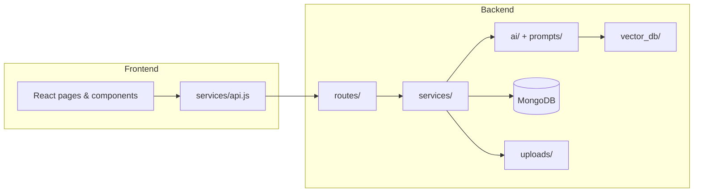

# AI Career Mentor

A full-stack AI career coaching app. This repository contains **project structure and setup only** — features are added incrementally on top of this foundation.

## Tech stack

| Layer | Tools |
|-------|--------|
| Frontend | React, Tailwind CSS, Vite |
| Backend | FastAPI, LangChain, FAISS |
| Database | PostgreSQL (Neon) |
| Deployment | Render |

## Project layout

```
ai--career-mentor/
├── frontend/                 # React UI (what users see in the browser)
├── backend/
│   ├── app/
│   │   ├── routes/           # HTTP endpoints (API URLs)
│   │   ├── services/         # Business logic
│   │   ├── ai/               # LangChain + FAISS code
│   │   ├── prompts/          # LLM prompt templates
│   │   ├── models/           # Request/response data shapes
│   │   └── db/               # MongoDB connection
│   ├── uploads/              # User-uploaded files (resumes, etc.)
│   └── vector_db/            # FAISS index files (semantic search)
└── README.md
```

## Folder guide (beginner-friendly)

### `frontend/`

Everything the **user interacts with** in the browser.

| Subfolder / file | Purpose |
|------------------|---------|
| `src/components/` | Reusable UI pieces (buttons, cards, chat bubbles). |
| `src/pages/` | Full screens (dashboard, chat, profile). |
| `src/hooks/` | Custom React hooks (e.g. shared state or effects). |
| `src/services/` | Functions that call the backend API — keeps fetch logic out of components. |
| `src/utils/` | Small helpers (formatting dates, validating input). |
| `public/` | Static assets (favicon, images) served as-is. |

**Rule of thumb:** Components render UI; `services/` talks to the API; pages compose components into screens.

---

### `backend/`

The **server** that the frontend calls. Handles auth, data, AI, and file storage.

| Subfolder / file | Purpose |
|------------------|---------|
| `app/main.py` | Starts FastAPI and wires routes together. |
| `app/config.py` | Reads settings from `.env` (DB URL, API keys, paths). |

---

### `backend/app/routes/`

**API endpoints** — the URLs your frontend hits (`GET /api/health`, `POST /api/chat`, etc.).

- Should stay **thin**: validate input, call a service, return JSON.
- Do **not** put heavy logic or AI code here.

**Example flow:** Browser → `routes/chat.py` → `services/chat_service.py` → response.

---

### `backend/app/services/`

**Business logic** — the “brain” between routes and data/AI.

- Orchestrates MongoDB reads/writes, file handling, and AI modules.
- One service per feature area (e.g. `user_service.py`, `mentor_service.py`).
- Easier to test and change without touching HTTP layer.

---

### `backend/app/ai/`

**AI-specific code** — LangChain chains, embeddings, FAISS load/save/search.

- Keeps LLM complexity isolated from normal CRUD.
- Typical files later: `embeddings.py`, `vector_store.py`, `chains.py`.

---

### `backend/app/prompts/`

**Prompt templates** as plain `.txt` or `.md` files.

- Edit prompts without redeploying Python logic.
- Load in `ai/` modules and pass to LangChain.

---

### `backend/uploads/`

**User-uploaded files** (resumes, cover letters, PDFs).

- Not committed to git (see `.gitignore`) — only the folder placeholder is tracked.
- Paths come from `config.py` → `UPLOADS_DIR`.

---

### `backend/vector_db/`

**FAISS index files** for semantic search over career content.

- Built at runtime from documents you embed.
- Also gitignored except `.gitkeep` — indexes are regenerated or downloaded separately.

---

### `backend/app/models/`

**Data shapes** — Pydantic models for API request/response bodies and shared types.

---

### `backend/app/db/`

**MongoDB** connection and database helpers (`mongodb.py`).

---

## How the layers connect



## Prerequisites

- **Node.js** 18+ and npm
- **Python** 3.11+
- **MongoDB** running locally or a cloud URI (Atlas)

## Setup

### 1. MongoDB

Install and start MongoDB locally, or create a free cluster at [MongoDB Atlas](https://www.mongodb.com/cloud/atlas) and copy the connection string.

### 2. Backend

```bash
cd backend

# Create and activate a virtual environment
python -m venv .venv

# Windows (PowerShell)
.\.venv\Scripts\Activate.ps1

# macOS / Linux
# source .venv/bin/activate

pip install -r requirements.txt

# Environment variables
copy .env.example .env   # Windows
# cp .env.example .env   # macOS / Linux
# Edit .env — set MONGODB_URI and OPENAI_API_KEY

# Run API (from backend/ directory)
uvicorn app.main:app --reload --host 0.0.0.0 --port 8000
```

- API: http://localhost:8000  
- Interactive docs: http://localhost:8000/docs  
- Health check: http://localhost:8000/api/health  

### 3. Frontend

```bash
cd frontend

npm install

copy .env.example .env   # Windows — optional; defaults use Vite proxy
# cp .env.example .env

npm run dev
```

- App: http://localhost:5173  
- `/api` requests are proxied to the backend (see `frontend/vite.config.js`).

## Deployment on Render

This project is pre-configured to deploy to Render with a single click!

### 1. Prerequisites
- A GitHub account with your project pushed
- A Render account (free tier works)
- A GitHub Personal Access Token (for GitHub Models)

### 2. Deploy Steps
1. Go to [Render](https://render.com) and sign in with your GitHub account
2. Click "New +" → "Blueprint"
3. Connect your GitHub repository
4. Render will automatically detect `render.yaml` and create:
   - A PostgreSQL database
   - A backend web service
   - A frontend static site
5. When prompted, enter your **GITHUB_TOKEN** in the environment variables
6. Wait for all services to deploy (takes a few minutes)

### 3. Post-Deployment
- Your app will be available at: `https://ai-career-mentor-frontend.onrender.com`
- Backend API: `https://ai-career-mentor-backend.onrender.com`
- You can view logs and manage services in the Render dashboard

## What to build next

Suggested order:

1. User profile routes + PostgreSQL models  
2. Resume upload → `uploads/` + metadata in PostgreSQL  
3. Embed documents → build FAISS index in `vector_db/`  
4. Chat route → `services/` + `ai/` + `prompts/`  
5. React chat UI in `frontend/src/pages/`  

## Scripts reference

| Location | Command | Description |
|----------|---------|-------------|
| `backend/` | `uvicorn app.main:app --reload` | Run API with hot reload |
| `frontend/` | `npm run dev` | Run React dev server |
| `frontend/` | `npm run build` | Production build |

---

This structure scales by **adding files inside the right folder** instead of growing one large file. Keep routes thin, logic in services, and AI isolated under `ai/` and `prompts/`.
